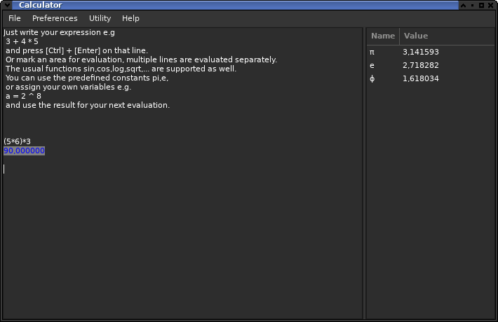

# calcpp
A desktop calculator

A simple lightweight desktop calculator
(this time based on C++11 to try some it's features.
As far i coud see they are useful,
and as i'am just getting use to it not try to over featurize).
Write down your calculation e.g.:
<pre>
3 + 4 * 5
</pre>
and press [control] and [enter] to evaluate it.

Adjustable output format: decimal, scientific, hexadecimal and octal.
Input for decimal and hexdecimal numbers with local support
(octal numbers e.g. 0123 are only parsed as such when the output format is octal).
Adjustable angle unit: radian, degree, grad.

The following operators are supported:
<pre>
+,- add, subtract
*,/,% multiply, divide, modulo
^ or ** power
|,&,!,<<,>> logical or, and, xor, shift left, shift right
</pre>

The following functions are supported:
<pre>
* sqrt, square root
* cbrt, cubic root
* log,ln, logarithm on base e
* log2, logarithm on base 2
* log10,lg, logarithm on base 10
* exp, e ^ x
* sin, sinus
* cos, cosinus
* tan, tangens
* asin, arcus sinus
* acos, arcus cosinus
* atan, arcus tangens
* abs, absolut value
* fac, factorial (usually writen as !)
</pre>

Usage of variables e.g.
<pre>
a = 3 + 4 * 5
b = a + 7
</pre>
the variable table can be edited so its easy to change a value by clicking it.
Or rename a variable by clicking on its name.
To remove a variable you can change its name to an empty string.

Unicode support for variable/constant names
e.g. π (if you read this without unicode support small greek letter pi)

Automatic save/restore of edit buffer and window position.

A character list allows picking symbols by choosing a unicode page and
click on the character.

A simple calendar view is included.

Issues:
* The parsing doesn't support grouping separators
  (and they are missing in output as well).

To build on (Lin)ux use:
<pre>
autoreconf -fis
./configure ...
make
</pre>

Build for windows was integrated at least for msys2 
<pre>
  look for "$host_os" = "mingw32"
</pre>